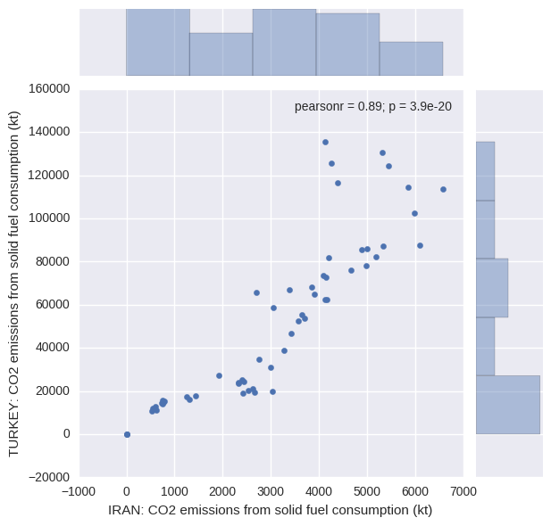

# Seaborn visualisation
CO2 emission comparison using Iran's and Turkey's dataset from World Bank website

# Sample graph

 In this graph I visualised Iran's and Turkey's datasets of CO2 emmision from various sources by going through these steps: 
 
 - I cleaned these datasets and kept the important rows 
 - I altered the missing data values with zero
 - The last graph shows that since 1978 to 2013 Iran has made more polution from solid fuels than Turkey.

# Requrements
1. Python 2
1. Pandas
2. Numpy
3. Seaborn
